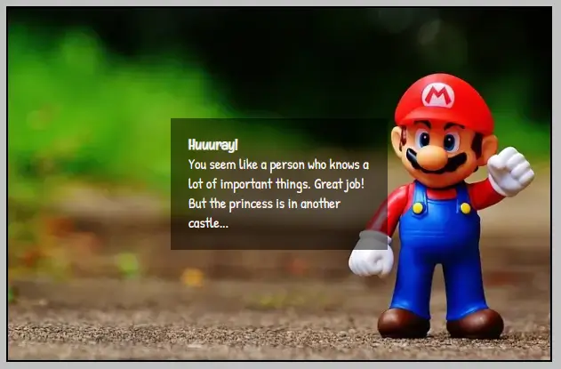
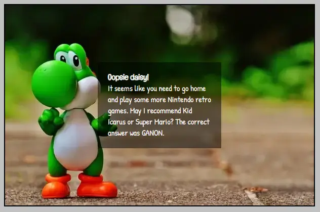

# Hangman - Retro Nintendo Games Characters

## Introduction

The site is a game for having fun and test your knowledge in retro Nintento game characters. The answers don't need to be the heroes, villains and kidnapped princesses are also welcome.

## Table of Contents

## User Experience

### User Stories

#### User Goals

The user should experience a retro flashback to the great period when Mario was the greatest hero, the princess was always in another castle and you had to leave the Nintendo on during the nights because you couldn't save your progress. The user should be able to play and test their knowledge in retro Nintendo game characters.

#### Site Owner Goals

The site owner goals is to share the interest about retro Nintendo games and provide a fun experience for the user.

## Design

### Colour Scheme

The colors are chosen with a starting point at the chalkboard. The color was chosen to match and at the same time make the chalkboard pop out.

### Typography

The fonts are chosen to make it look like hand writing and at the same time make it easy for the user to read. They are chosen by scrolling through Google Fonts when the filter of only showing sans serif was set.

### Imagery

The chalkboard is supposed to give the user a feeling of being back in the classroom and playing hangman at the breaks. The winning and losing images are supposed to give a nostalgic feeling and making the user longing to dust of their old Nintendo consoles.

### Wireframes

The wireframes for desktop, tablet devices and mobile devices.

## Features

### Header

The headers purpose is to help the user to see what the theme is.

The game area were the user initially can see the number of letters the correct answer. The hangman is displayed and updated when a incorrect guess is made. It's also here the correct guessed letters will appear. The number of incorrect guesses are displayed here.

The keyboard with the letters a-z. The user will use this letter to guess which the hidden answer is. When a letter is pressed, it becomes disabled until you use the "Start over" button. The button reset the game, clear the correct and incorrect guesses and present a new hidden answer.

The footer explains the rules of the hangman game.

The screen that is shown instead of the chalkboard when the game is won. The text give compliments to the user after giving the correct answer.

The screen that is shown instead of the chalkboard when the game is lost. The text tells the user the correct answer.

## Features to be Added

One feature to be added is to create a toplist. It allows the user to compare its answer, how fast they answer and how few incorrect letters they used, with other users. This can give the user the motivation to play the game over and over again.

## Testing

### Validation of Code

Insert screenshots of HTML, CSS and any other code files being tested in the relevant code validator - CSS validator might not validate newer CSS syntax - be careful to read and fully understand why it is giving you an error.

### Lighthouse

You can perform a test of your website for performance, accessibility, best practices and SEO through the google chrome lighthouse test - it is in your Dev tools. Bear in mind that your internet connection speed plays a part in the performance figures obtained. Where it scores low, it will give you suggestions on how to improve the site - read the suggestions and think about how to implement them - it could be a good idea.
Do this for both Desktop and Mobile.

### Wave Webaim - accessibility testing

You can test your site for accessibility through the wave.webaim site - it needs to be deployed in order for it to test it. Fix any errors that it gives

### Manual Testing

You need to perform, and document everything you did to manually test your site.
At a minimum - you need to check every link on every page works as intended.
So that is check every link in the nav bar (do this on every single page because its a link in a different file) and any other links that appear on your site.
Test the responsiveness of the site - you can do this in the dev tools in responsive mode.
You should also load the site once deployed on as many devices you have access to. What is different from one device to the next? why is it different?

Test the user stories that you created earlier in the readme - did you satisfy the goal, how?

To write up the tests you can use a table,
| Feature being tested | Expected Outcome | Testing Performed | Actual Outcome | Result (Pass or fail) |
| -------------------- | ---------------- | ----------------- | -------------- | --------------------- |
| enter details here | enter details here | enter details here | enter details here | enter details here |

You should have tests for every section of every page.. individually.

## Technologies Used

The game was build using HTML, CSS and JavaScript. The repository was made in GitHub and the code was written in CodeAnywhere.
The wireframes were made in Balsamiq.

## Deployment

Detail how to clone the repository, how to fork the repository - how to run the site locally and how to deploy it.

## Credits

### Code

### Images

You need to credit where you got anything for your site from.. where are the images from, are they all from the same site? where did you get the content from, if you wrote it yourself, did you fact check anywhere? did you get code from anywhere? if so, it needs to be clearly marked in both the code and the readme.

## Acknowledgements

Any special acknowledgements you'd like to leave

Back to top link to return to the top of the readme.
