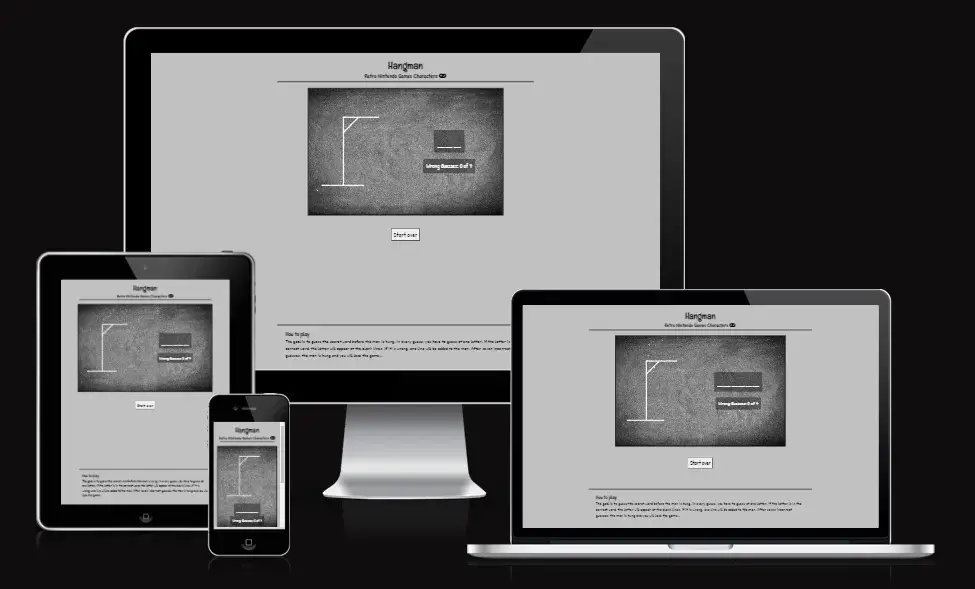
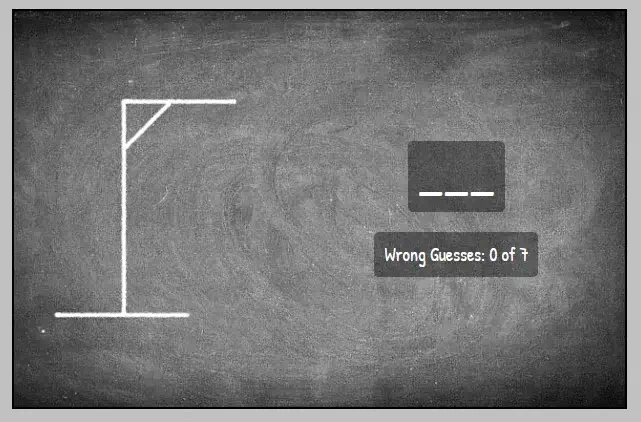
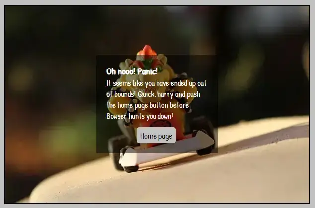
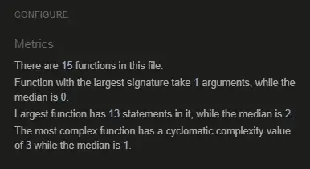
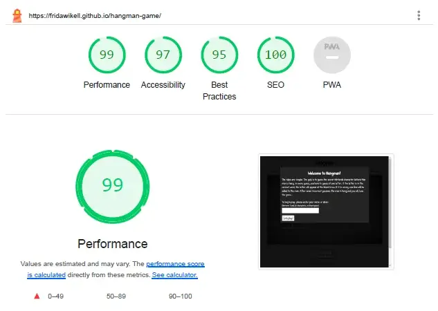
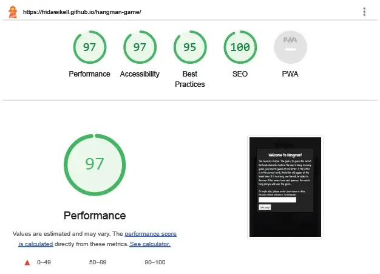
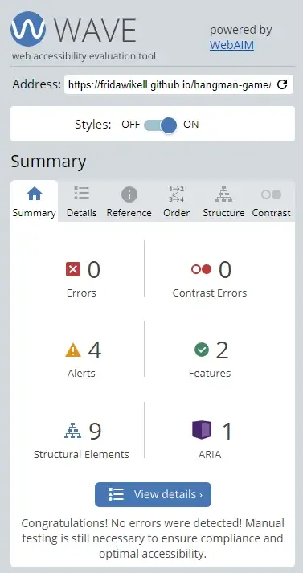
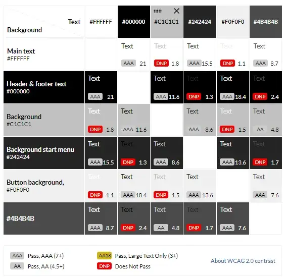

# Hangman - Retro Nintendo Games Characters

## Introduction

The site is a game for having fun and test your knowledge in retro Nintento game characters. The answers don't need to be the heroes, villains and kidnapped princesses are also welcome.

## Table of Contents

- [Hangman - Retro Nintendo Games Characters](#hangman---retro-nintendo-games-characters)
  - [Introduction](#introduction)
  - [Table of Contents](#table-of-contents)
  - [User Experience](#user-experience)
    - [User Goals](#user-goals)
    - [Site Owner Goals](#site-owner-goals)
  - [Design](#design)
    - [Colour Scheme](#colour-scheme)
    - [Typography](#typography)
    - [Imagery](#imagery)
    - [Wireframes](#wireframes)
  - [Features](#features)
    - [Header](#header)
    - [Start menu](#start-menu)
    - [Chalkboard area](#chalkboard-area)
    - [Keyboard](#keyboard)
    - [Footer](#footer)
    - [Winning page](#winning-page)
    - [Losing page](#losing-page)
    - [No script](#no-script)
    - [404 page](#404-page)
  - [Features to be Added](#features-to-be-added)
  - [Testing](#testing)
    - [Validation of Code](#validation-of-code)
    - [Lighthouse](#lighthouse)
    - [Wave Webaim](#wave-webaim)
    - [Contrast Grid](#contrast-grid)
    - [Manual Testing](#manual-testing)
      - [Welcome page](#welcome-page)
      - [Game area](#game-area)
      - [Winning page](#winning-page-1)
      - [Losing page](#losing-page-1)
      - [No script page](#no-script-page)
      - [404 page](#404-page-1)
    - [Bugs](#bugs)
  - [Technologies Used](#technologies-used)
  - [Deployment](#deployment)
  - [Credits](#credits)
    - [Code](#code)
    - [Images](#images)
    - [Other](#other)
  - [Acknowledgements](#acknowledgements)

## User Experience

### User Goals

The user should experience a retro flashback to the great period when Mario was the greatest hero, the princess was always in another castle and you had to leave the Nintendo on during the nights because you couldn't save your progress. The user should be able to play and test their knowledge in retro Nintendo game characters.

### Site Owner Goals

The site owner goals is to share the interest about retro Nintendo games and provide a fun experience for the user.

## Design

### Colour Scheme

The colors are chosen with a starting point at the chalkboard. The color was chosen to match and at the same time make the chalkboard pop out.

### Typography

The fonts are chosen to make it look like hand writing and at the same time make it easy for the user to read. They are chosen by scrolling through [Google Fonts](https://fonts.google.com/) when the filter of only showing sans serif was set.

### Imagery

The chalkboard is supposed to give the user a feeling of being back in the classroom and playing hangman at the breaks. The winning and losing images are supposed to give a nostalgic feeling and making the user longing to dust of their old Nintendo consoles.

### Wireframes

The wireframes for desktop, tablet devices and mobile devices.

## Features

### Header

The headers purpose is to help the user to see what the theme is.

### Start menu

The start menu makes the user fill out their name before they start the game.

### Chalkboard area

The game area were the user initially can see the number of letters the correct answer. The hangman is displayed and updated when a incorrect guess is made. It's also here the correct guessed letters will appear. The number of incorrect guesses are displayed here.

### Keyboard

The keyboard with the letters a-z. The user will use this letter to guess which the hidden answer is. When a letter is pressed, it becomes disabled until you use the "Start over" button. The button reset the game, clear the correct and incorrect guesses and present a new hidden answer.

### Footer

The footer explains the rules of the hangman game.

### Winning page

The screen that is shown instead of the chalkboard when the game is won. The text give compliments to the user after giving the correct answer.

### Losing page

The screen that is shown instead of the chalkboard when the game is lost. The text tells the user the correct answer.

### No script

The page is shown when the user has disabled script. It gives the user an order to enable script to be able to play the game.

### 404 page

If the user try to visit a page that doesn't exist, the 404 page is shown. It has a home page button which takes the user back to the home page.

## Features to be Added

One feature to be added is to create a toplist. It allows the user to compare its answer, how fast they answer and how few incorrect letters they used, with other users. This can give the user the motivation to play the game over and over again.

## Testing

### Validation of Code

The test at [W3C Markup Validation Service](https://validator.w3.org/) resulted without errors.

The test at [W3C CSS Validator](https://jigsaw.w3.org/css-validator/) resulted without errors.

The test at [JSHint](https://jshint.com/) resulted without errors.

### Lighthouse

The test at Lighthouse for desktops gave the result 99 in performance and 97 in accessibility.

The test at Lighthouse for mobile devices gave the result 97 in performance and 97 in accessibility.

### Wave Webaim

The test at Wave Webaim resulted in 0 errors.

### Contrast Grid

The test at [Contrast Grid](https://contrast-grid.eightshapes.com/?version=1.1.0&background-colors=&foreground-colors=%23FFFFFF%2C%20%20Main%20text%0D%0A%23000000%2C%20Header%20%26%20footer%20text%0D%0A%23c1c1c1%2C%20Background%0D%0A%23242424%2C%20Background%20start%20menu%0D%0A%23f0f0f0%2C%20Button%20background%2C%0D%0A%234b4b4b.%20Chalkboard&es-color-form__tile-size=compact&es-color-form__show-contrast=aaa&es-color-form__show-contrast=aa&es-color-form__show-contrast=aa18&es-color-form__show-contrast=dnp) resulted in only AAA results in the combination used at the website.

### Manual Testing

Every page at the website has been manually tested. It is done in Google Chrome DevTools and on different devices. The devices used was one mobile phone, one laptop and one external screen:

Samsung Galaxy A52s (1080 x 2400)
HP 250 G4 Notebook PC (1366 x 768)
HP 2309v LCD Screen (1920 x 1080)

#### Welcome page

| Feature being tested | Expected Outcome | Testing Performed | Actual Outcome | Result (Pass or fail) |
| -------------------- | ---------------- | ----------------- | -------------- | --------------------- |
| No skipping of name input| Not being able to close the welcome window by clicking | Click everywhere wihtout enter name. Background, welcome window, text, input field, button is fields to click at | The welcome window didn't close | Pass |
| Enter a validated name | Forced to enter name between 3 and 20 characters, no blankspace | Enter different combinations of name. Less than three letters and combination of blankspace and letters | Entering "ss" followed by three blankspaces didn't render in a valid input. Entering "dd" didn't render in a valid input. | Pass |
| Alert if the user try to enters incorrect name | An alert will tell the user to enter a valid input | Enter an invalid input | When a invalid input was entered, an alert window was opened which said "Please enter a name with at least three characters and without blankspace | Pass |
| Responsivness | The page changes so the content fit at the smallest to the largest screens without scrolling | In DevTools, select the smallest device and make it larger step by step | The welcome page was responsive and changed depending on screen size | Pass |
| Window close when a correct name is entered | Welcome window closes when a valid name is entered | Enter a valid name | The welcome window closes when a valid name is entered | Pass |

#### Game area

| Feature being tested | Expected Outcome | Testing Performed | Actual Outcome | Result (Pass or fail) |
| -------------------- | ---------------- | ----------------- | -------------- | --------------------- |
| Hangman image update | Hangman image updates when an incorrect answer is made | Give an incorrect answer | The image updates when an incorrect answer is made | Pass |
| Wrong guesses update | Number of wrong guesses updates when an incorrect answer is made | Give an incorrect answer | The number of wrong guesses is updated when an incorrect answer is made | Pass
| Underscore update | When a correct guess is made, the underscore is replaced with the letter | Give a correct answer | The underscore is replaced with the letter | Pass |
| Usable keyboard | The buttons are pushable and pushing a letter gives a guess at the same letter | Push buttons at the keyboard | The buttons are clickable and pushing a button gives a guess at the same letter as pushed | Pass |
| Pushed letter disabled | Button gets disabled when it's pressed | Push a button | Button got disabled when it was pushed | Pass |
| Start over button | Pushing start button makes the game start again | Push the Start over button | The game was resetted | Pass |
| Responsivness | The page changes so the content fit at the smallest to the largest screens without scrolling | In DevTools, select the smallest device and make it larger step by step | The page was responsive and changed depending on screen size | Pass |
| Direct to winning page | When the game is won, direct to winning page | Guess the correct answer | The page was directed to the winning page when the game was won | Pass |
| Direct to losing page | When the game is lost, direct to losing page | Give seven incorrect guesses | The page was directed to the losing page when the game was lost | Pass |

#### Winning page

| Feature being tested | Expected Outcome | Testing Performed | Actual Outcome | Result (Pass or fail) |
| -------------------- | ---------------- | ----------------- | -------------- | --------------------- |
| Name appears | The entered name is shown | Enter a valid name, win the game | The entered name was shown | Pass |
| Start over button | Pushing start button sends the player to the hangman game again | Push the Start over button | The game was started again | Pass |
| Responsivness | The page changes so the content fit at the smallest to the largest screens without scrolling | In DevTools, select the smallest device and make it larger step by step | The page was responsive and changed depending on screen size | Pass |

#### Losing page

| Feature being tested | Expected Outcome | Testing Performed | Actual Outcome | Result (Pass or fail) |
| -------------------- | ---------------- | ----------------- | -------------- | --------------------- |
| Name appears | The entered name is shown | Enter a valid name, lose the game | The entered name was shown | Pass |
| Show correct answer | The correct answer is shown | Look for the correct answer | The correct answer is presented last in the text | Pass |
| Start over button | Pushing start button sends the player to the hangman game again | Push the Start over button | The game was started again | Pass |
| Responsivness | The page changes so the content fit at the smallest to the largest screens without scrolling | In DevTools, select the smallest device and make it larger step by step | The page was responsive and changed depending on screen size | Pass |

#### No script page

| Feature being tested | Expected Outcome | Testing Performed | Actual Outcome | Result (Pass or fail) |
| -------------------- | ---------------- | ----------------- | -------------- | --------------------- |
| Responsivness | The page changes so the content fit at the smallest to the largest screens without scrolling | In DevTools, select the smallest device and make it larger step by step | The page was responsive and changed depending on screen size | Pass |

#### 404 page

| Feature being tested | Expected Outcome | Testing Performed | Actual Outcome | Result (Pass or fail) |
| -------------------- | ---------------- | ----------------- | -------------- | --------------------- |
| Home page button | Home page button direct the user to the home page | Push Home page button | Pushing Home Page Button sends the user to the home page | Pass |
| Responsivness | The page changes so the content fit at the smallest to the largest screens without scrolling | In DevTools, select the smallest device and make it larger step by step | The page was responsive and changed depending on screen size | Pass |

### Bugs

During the testing several bugs has been discovered. No bugs were left unfixed.

When a HTML validation was made, an error was generated. The error was "Element div not allowed as child of element label". The bug was solved by moving the div out from the label, making the div and label siblings.

After a validation at JSHint, three unused variables were found. Two of them were removed since they weren't used. The last one was kept since it was used but embedded in a innerHTML where JSHint didn't discovered the function. The function was rewritten so the function wasn't in innerHTML anymore.

When the [contrast grid](#contrast-grid) was made, a AA value (6.4) was at the website. To increase the accessibility, the color was replaced with another one which gave an AAA value.

## Technologies Used

The game was build using HTML, CSS and JavaScript. The repository was made in GitHub and the code was written in CodeAnywhere.
The wireframes were made in Balsamiq.

## Deployment

The site was deployed at GitHub pages.

- In GitHub, open the repository.
- Go into the Settings tab.
- In the menu on the left side, choose "Pages".
- Under "Build and deployment", go to "Branch". In the dropdown menu where it says "none", change to "main".
- Press "Save".
  
Link to the website <https://fridawikell.github.io/hangman-game/>.

## Credits

### Code

To create the keyboard, code from [Simon Suh - Vanilla Javascript Hangman Game](https://github.com/simonjsuh/Vanilla-Javascript-Hangman-Game/blob/master/js/hangman.js) was used. Knowledge about index of to the compareAnswer function was gathered from [freeCodeCamp](https://www.freecodecamp.org/news/how-to-check-if-a-string-contains-a-substring-javascript/). To create the guessed word, a thread at [Stackoverflow](https://stackoverflow.com/questions/74006820/how-to-split-a-word-in-a-string-and-replace-letters-with-different-characters-in) was used.
The validation of only letters in name input was made with code from [w3resource](https://www.w3resource.com/javascript/form/all-letters-field.php).

### Images

The chalkboard, Super Mario, Yoshi, Luigi and Bowser images are all a free images from Pixabay.

To convert the images to webp, [Convertio](https://convertio.co/) and [Cloudconvert](https://cloudconvert.com/) was used. [TinyPNG](https://tinypng.com/) was used to compress the images.

### Other

The Favicon is from [Favicon](https://favicon.io/) and is licensed by CC BY 4.0 DEED.
THe icon in the header is from [Font Awesome](https://fontawesome.com/).

Picking the color from the chalkboard and the button background to the [Contrast Grid](#contrast-grid) was made using [Pickcoloronline](https://pickcoloronline.com/tutorials/pick-color-from-website/).

## Acknowledgements

Any special acknowledgements you'd like to leave

[Back to top](#hangman---retro-nintendo-games-characters)
